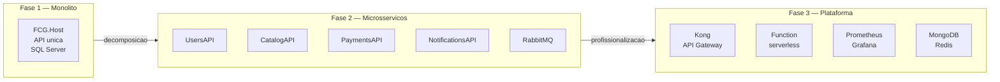
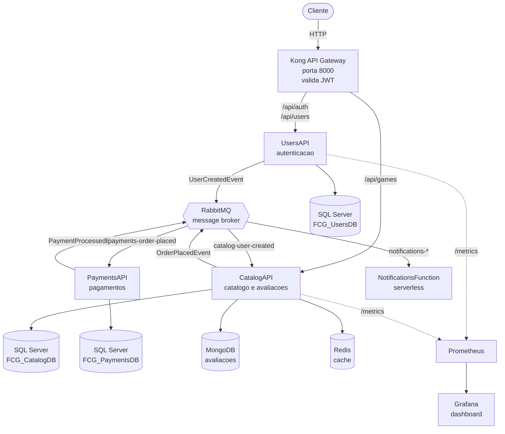
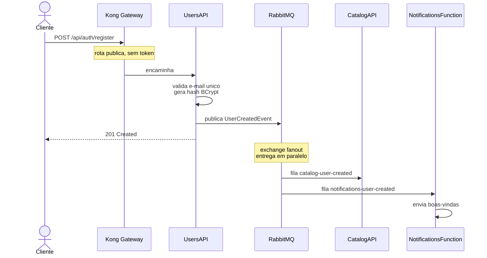
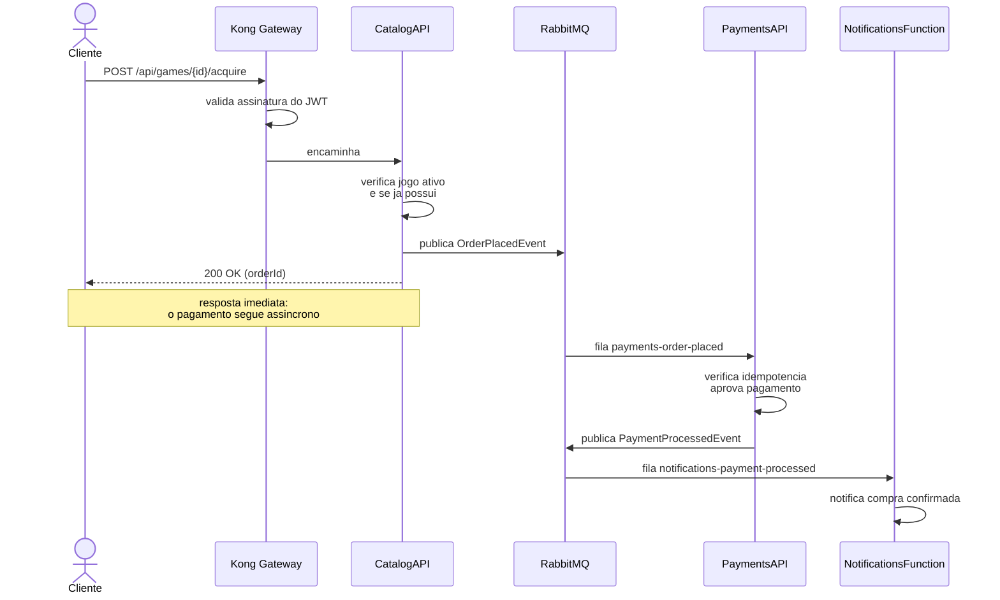
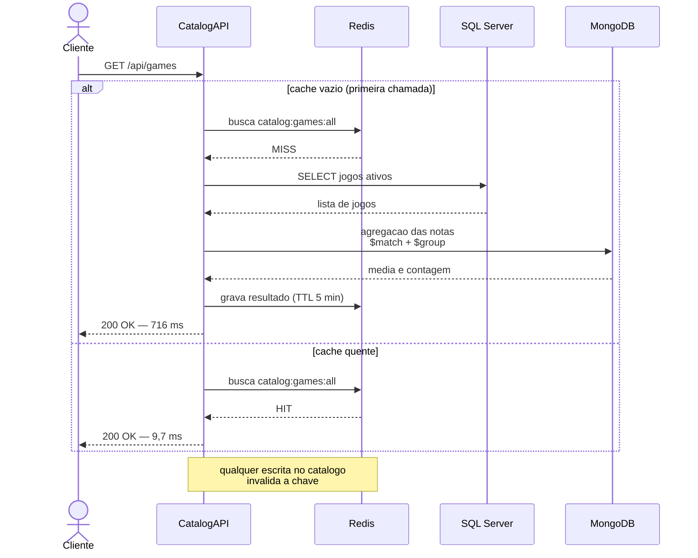
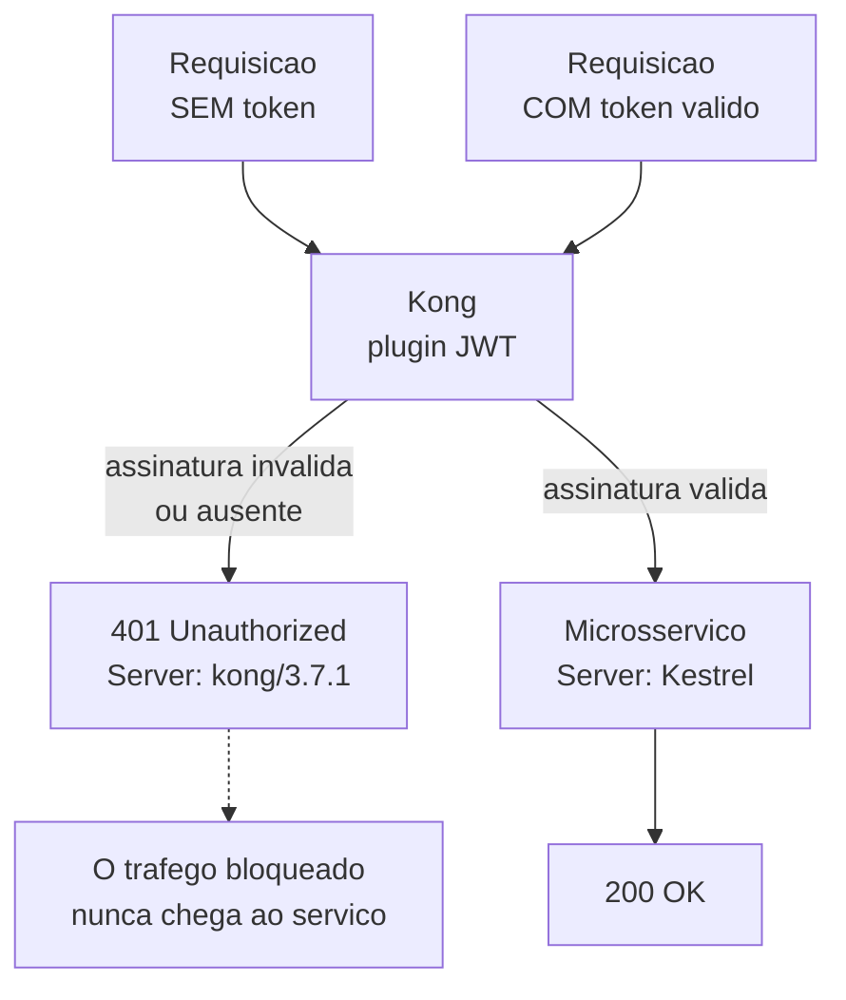
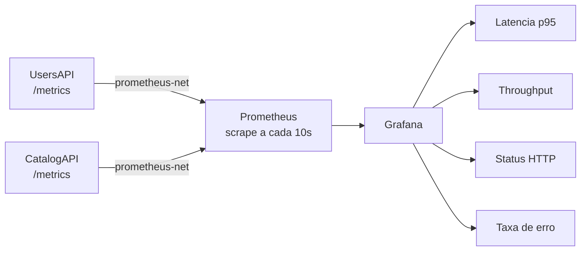
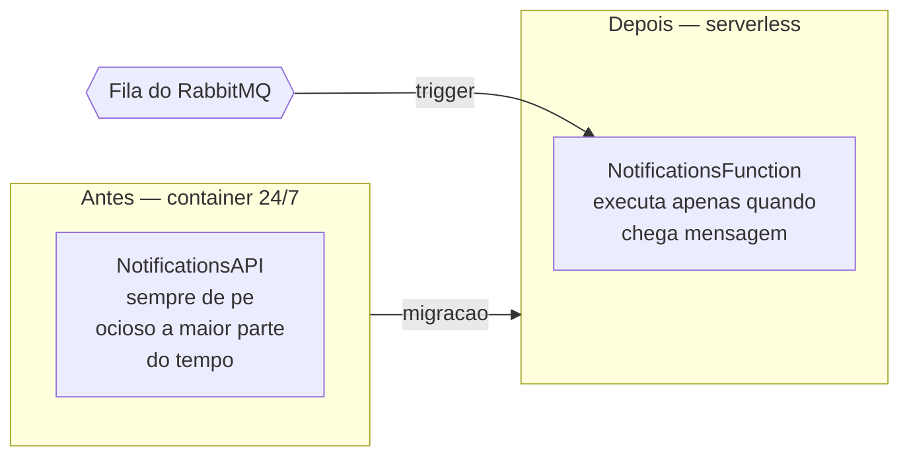

# Diagramas da arquitetura

---

## 1. Evolução do projeto

Abertura da apresentação: de onde viemos e onde chegamos.

---

## 2. Visão geral da arquitetura

O diagrama principal: mostra o gateway como entrada única, a mensageria no centro e cada serviço com sua persistência.

---

## 3. Fluxo de cadastro de usuário

---

## 4. Fluxo de compra

O fluxo mais completo — mostra a cadeia de eventos entre três serviços.

---

## 5. Persistência poliglota

Uma única requisição usando as três tecnologias de armazenamento.

---

## 6. Segurança no gateway

Contraste entre requisição bloqueada e autorizada.

---

## 7. Observabilidade

---

## 8. Serverless: antes e depois

---

## Dicas de uso

- No Excalidraw: **More tools → Mermaid to Excalidraw**, cole o bloco e clique em *Insert*.
- O conversor suporta bem `flowchart` e `sequenceDiagram`. Se algum diagrama não converter, simplifique removendo os `subgraph`.
- Depois de inserido, tudo vira elemento editável: dá para reposicionar, mudar cores e destacar partes durante a apresentação.
- Sugestão de ordem na apresentação: diagrama 1 (contexto) → 2 (visão geral) → 3 e 4 (fluxos) → 5, 6, 7 e 8 (requisitos da fase, um a um).
